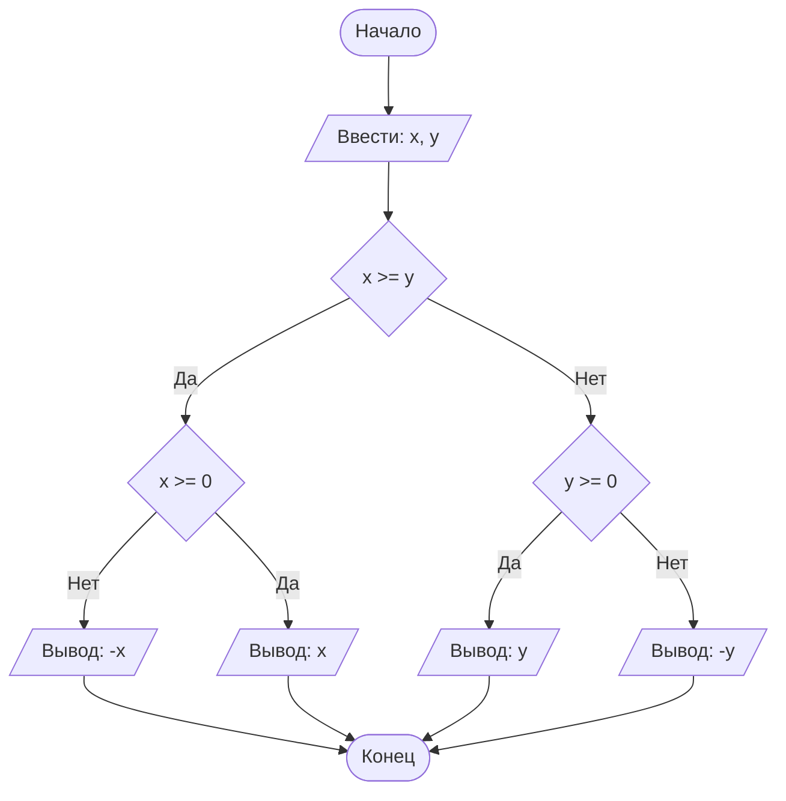

## Отчет по лабораторной работе № 1

#### № группы: `ПМ-2402`

#### Выполнил: `Гладких Василий Васильевич`

#### Вариант: `6`

### Cодержание:

- [Постановка задачи](#1-постановка-задачи)
- [Входные и выходные данные](#2-входные-и-выходные-данные)
- [Выбор структуры данных](#3-выбор-структуры-данных)
- [Алгоритм](#4-алгоритм)
- [Программа](#5-программа)
- [Анализ правильности решения](#6-анализ-правильности-решения)

### 1. Постановка задачи

> Программа получает на вход 2 числа a и b - коэффициенты при x, не превышающих по модулю 10<sup>308</sup>.
> Нужно решить неравенство относительно x, учитывая ограничения.

Данную задачу можно разделить на 2 подзадачи: предобработка входных данных и решение самого неравенства.

Чтобы программа адекватно реагировала на неправильный формат введенных данных, был написан метод, который 
возвращает значение true, если число корректно для решения неравенства, и false в противном случае.

Для решения неравенства следует рассмотреть следующие случаи:

- Перед решением стоит определить, корректны ли введенные данные:
  
  
       
### 2. Входные и выходные данные

#### Данные на вход

На вход программа должна получать 2 числа, при этом в условии не сказано, к какому множеству
принадлежать получаемые числа, поэтому будем считать их вещественными. Верхняя и нижняя границы получаемых
чисел есть диапазон допустимых значений типа double.

|             | Тип                | min значение    | max значение   |
|-------------|--------------------|-----------------|----------------|
| a (Число 1) | Вещественное число |-(10<sup>308</sup>)|10<sup>308</sup>|
| b (Число 2) | Вещественное число |-(10<sup>308</sup>)|10<sup>308</sup>|

#### Данные на выход

Программа в зависимости от введенных параметров выводит решение неравенства в выражения.
Если формат не данных не подходит, программа выводит сообшение об этом.

|         | Тип                                | min  | max значение   |
|---------|------------------------------------|--------------|----------------|
| Логическое выражение | Строка | -        | - |

### 3. Выбор структуры данных

Программа получает 2 числа (в строке), происходит проверка на корректность, далее двум переменным типа double присваивается значение этих введенных чисел (проверка в теории должна отсеить все неподходящие данные).

|             | название переменной | Тип (в Java) | 
|-------------|---------------------|--------------|
| a (Число 1) | `a`                 | `double`     |
| b (Число 2) | `b`                 | `double`     | 


### 4. Алгоритм

#### Алгоритм выполнения программы:

1. **Ввод данных:**  
   Программа считывает две строки, обозначенные как `first` и `second`.

2. **Проверка на корректность:**
   f(x) - обозначение метода
   Проверяется условие,выдадут ли f(first) и f(second) значение true
   Если все хорошо, то в переменные a и b записываются значения

4. **Начало решения неравенства:**
   После того, как мы присвоили значения a и b, следует проверить, не равен ли параметр b нулю.
   Если это так, программа завершается и выводит сообщение о том, что вы ввели 0 в знаменатель.

   Если b != 0, нужно понять, поменяется ли знак неравенства.
   
   -Если b положительное, знак остается таким же.
   *Если a = 0, то x !=0.*
   *Если -a < 0, то -a <= x < 0*
   *Если -a > 0, то 0 < x <= -a*
   
    

6. **Вывод результата:**  
   На экран выводится либо большее из чисел, либо его модуль, если это число отрицательное.

#### Блок-схема



### 5. Программа

```java
import java.io.PrintStream;
import java.util.Scanner;

public class Main {
    // Объявляем объект класса Scanner для ввода данных
    public static Scanner in = new Scanner(System.in);
    // Объявляем объект класса PrintStream для вывода данных
    public static PrintStream out = System.out;

    public static void main(String[] args) {
        // Считывание двух вещественных чисел x и y из консоли
        double x = in.nextDouble();
        double y = in.nextDouble();

        // Определение максимального числа
        if (x >= y) {
            // Если x положительное, выводим x, иначе выводим -x,
            // чтобы на выходе было его абсолютное значение
            if (x >= 0) {
                out.println(x);
            } else {
                out.println(-x);
            }
        } else {
            // Если x положительное, выводим y, иначе выводим -y,
            // чтобы на выходе было его абсолютное значение
            if (y >= 0) {
                out.println(y);
            } else {
                out.println(-y);
            }
        }
    }
}
```

### 6. Анализ правильности решения

Программа работает корректно на всем множестве решений с учетом ограничений.

1. Тест на `X > Y > 0`:

    - **Input**:
        ```
        5 1.3
        ```

    - **Output**:
        ```
        5
        ```

2. Тест на `X < Y < 0`:

    - **Input**:
        ```
        -4 -2.2
        ```

    - **Output**:
        ```
        2.2
        ```

3. Тест на `X < 0 < Y`:

    - **Input**:
        ```
        -4 5
        ```

    - **Output**:
        ```
        5
        ```

4. Тест на `X = 0` или `Y = 0`:

    - **Input**:
        ```
        0 -3
        ```

    - **Output**:
        ```
        3
        ```

5. Тест на ограничение задачи:

    - **Input**:
        ```
        -1000000000 1000000000
        ```

    - **Output**:
        ```
        1000000000
        ```
