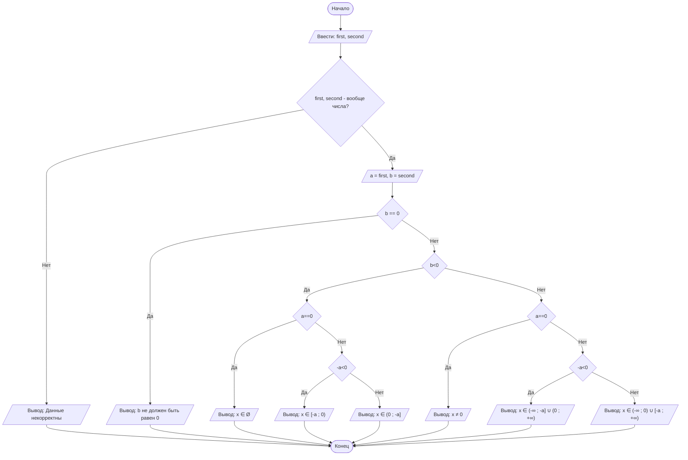

## Отчет по лабораторной работе № 1

#### № группы: `ПМ-2402`

#### Выполнил: `Гладких Василий Васильевич`

#### Вариант: `6`

### Cодержание:

- [Постановка задачи](#1-постановка-задачи)
- [Входные и выходные данные](#2-входные-и-выходные-данные)
- [Выбор структуры данных](#3-выбор-структуры-данных)
- [Алгоритм](#4-алгоритм)
- [Программа](#5-программа)
- [Анализ правильности решения](#6-анализ-правильности-решения)

### 1. Постановка задачи

> Программа получает на вход 2 числа a и b - коэффициенты при x, не превышающих по модулю 1.79<sup>308</sup>.
> Нужно решить неравенство относительно x, учитывая ограничения.

Данную задачу можно разделить на 2 подзадачи: предобработка входных данных и решение самого неравенства.

Чтобы программа адекватно реагировала на неправильный формат введенных данных, был написан метод, который 
возвращает значение true, если число корректно для решения неравенства, и false в противном случае.

Для решения неравенства следует рассмотреть следующие случаи:  
- Если b = 0
- Если b ≠ 0, тогда  
  1. b < 0
  * a = 0
  * -a < 0
  * -a > 0
  2. b > 0
  * a = 0
  * -a < 0
  * -a > 0
      
### 2. Входные и выходные данные

#### Данные на вход

На вход программа должна получать 2 числа, при этом в условии не сказано, к какому множеству
принадлежат получаемые числа, поэтому будем считать их вещественными. Верхняя и нижняя границы получаемых
чисел есть диапазон допустимых значений типа double.

|             | Тип                | min значение    | max значение   |
|-------------|--------------------|-----------------|----------------|
| a (Число 1) | Вещественное число |-(1.79<sup>308</sup>)|1.79<sup>308</sup>|
| b (Число 2) | Вещественное число |-(1.79<sup>308</sup>)|1.79<sup>308</sup>|

#### Данные на выход

Программа в зависимости от введенных параметров выводит решение неравенства в выражения.   
Решение выводится в виде строчки, к которой прибавляется корень числителя, ограниченный возможными значениями типа double.
Если формат не данных не подходит, программа выводит сообшение об этом.

|         | Тип                                | min  | max значение   |
|---------|------------------------------------|--------------|----------------|
| Логическое выражение | Строка | -        | - |

### 3. Выбор структуры данных

Программа получает 2 числа (в строке), происходит проверка на корректность, далее двум переменным типа double присваивается значение этих введенных чисел (проверка в теории должна отсеить все неподходящие данные).

|             | название переменной | Тип (в Java) | 
|-------------|---------------------|--------------|
| a (Число 1) | `a`                 | `double`     |
| b (Число 2) | `b`                 | `double`     | 


### 4. Алгоритм
(Перед этим происходит проверка на корректность ввода)    
 Если b = 0, конец алгоритма, вывод ошибки     
 Если b ≠ 0, нужно понять, поменяется ли знак неравенства.     
   
   -Если b > 0, знак остается таким же.       
   *Если a = 0, то x ≠ 0*   
   *Если -a < 0, то x ∈ (-∞ ; -a] ∪ (0 ; +∞)*    
   *Если -a > 0, то x ∈ (-∞ ; 0) ∪ [-a ; +∞)*
  
   -Если b < 0, знак менеятся.    
   *Если a = 0, то x ∈ Ø.*   
   *Если -a < 0, то x ∈ [-a ; 0)*    
   *Если -a > 0, то x ∈ (0 ; -a)*

#### Алгоритм выполнения программы:

1. **Ввод данных:**  
   Программа считывает две строки, обозначенные как `first` и `second`.

2. **Проверка на корректность:**
   f(x) - обозначение метода
   Проверяется условие,выдадут ли f(first) и f(second) значение true   
   Если все хорошо, то в переменные a и b записываются значения first и second соответственно     

3. **Решение неравенства:**
   После того, как мы присвоили значения a и b, следует проверить, не равен ли параметр b нулю.     
   Если это так, программа завершается и выводит сообщение о том, что вы ввели 0 в знаменатель.
   Даллее программа смотрит, положительный или отрицательный параметр b, потом в при каждом b(положительном и отрицательном)
   Смотрит еще три случая: где a-ноль, или противоположное событие, где еще одно и условие (корень числителя отрицательный?)
   и противоположное ему (т.е. корень положительный)
   
4. **Вывод результата:**  
   На экран  выводится множество решений, или сообщение о том, что решений нет.

#### Блок-схема



### 5. Программа

```java
import java.util.Scanner;

public class Main {

    public static Scanner in = new Scanner(System.in);

    // Метод, который проверяет введенное число на корректность

    public static boolean isNumber(String str) {


        if (str == null || str.isEmpty()) {
            return false; // Пустая строка или null не является числом
        }

        boolean hasDecimalPoint = false; // флаг для плавающей точки
        boolean hasMinusSign = false; // флаг для минуса

        // пробегаемся по строчке и смотрим символы
        for (int i = 0; i < str.length(); i++) {
            char ch = str.charAt(i);
            if (i == 0 && ch == '-') { // Первый символ - минус
                hasMinusSign = true; // теперь в потенциальном числе есть минус, если найдется еще, то метод вернет false
                continue;
            }
            if (Character.isDigit(ch)) {
                continue; // Если символ - цифра, пропускаем его

            } else if ((ch == '.' || ch == ',') && !hasDecimalPoint) {
                // Десятичная точка(запятая) может быть только один раз
                hasDecimalPoint = true; // аналогично ставим true для точки, еще одно вхождение вернет false
                continue;
            } else {
                return false; // Если символ не цифра, не минус(который является первым символом) или не точка, то это не число
            }
        }
        return true; // Если все символы прошли проверку, то это число
    }

    public static void main(String[] args) {

        System.out.println("Введите два параметра a и b - коэффициенты при x линейного неравенства.");
        System.out.println("a,b лежат в диапазоне [-(1.79^308) ; 1.79^308]");
        System.out.println("(x+a)/bx >= 0");
        // ввод параметров a и b
        System.out.print("Ввод a: ");
        String first = in.next();
        System.out.print("Ввод b: ");
        String second = in.next();


        //Решение неравенства

        if (!(isNumber(first) && isNumber(second))) { // Проверка на корректность ввода

            System.out.println("Введенные данные некорректны");

        } else {

            // Если все хорошо, присваиваю переменным заведомо корректные значения

            double a = Double.parseDouble(first.replace(',', '.')); // Так как сюда может попасть число
            double b = Double.parseDouble(second.replace(',', '.'));// с запятой, меняю ее на точку для
                                                                                    // перевода в double без ошибок.

            if (b == 0) { // Если условие b!=0 не соблюдено, то

                System.out.println("Параметр b не должен быть равен 0!");

            } else { // Если a,b - числа и b!=0

                if (b < 0) {
                    // меняем знак на <=
                    if (a == 0) {
                        System.out.println("Ответ: x ∈ Ø");
                    } else { // Нужно понимать, где лежит корень относительно 0
                        if (-a < 0) {
                            System.out.println("Ответ: x ∈ [" + (-a) + " ; 0)");
                        } else {
                            System.out.println("Ответ: x ∈ ( 0;" + (-a)+" ]");
                        }
                    }

                } else {
                    // знак остается >=
                    if (a == 0) {
                        System.out.println("Ответ: x ≠ 0");
                    } else {
                        if (-a < 0) {
                            System.out.println("Ответ: x ∈ (-∞ ; " + (-a)+"]" + "∪ (0 ; +∞)");
                        } else {
                            System.out.println("Ответ: x ∈ (-∞ ; 0) ∪ [" + (-a) +" ; +∞");
                        }
                    }
                }
            }
        }

        
    }
}
```

### 6. Анализ правильности решения

Программа работает корректно на всем множестве решений с учетом ограничений.

1. Тест на `a = 0, b>0`:

    - **Input**:
        ```
        0 1.3
        ```

    - **Output**:
        ```
        x ≠ 0
        ```

2. Тест на `a = 0, b<0`:

    - **Input**:
        ```
        0 -2,2
        ```

    - **Output**:
        ```
        x ∈ Ø
        ```

3. Тест на `b = 0`:

    - **Input**:
        ```
        -4 0
        ```

    - **Output**:
        ```
        Параметр b не должен быть равен 0!
        ```

4. Тест на `a > 0, b > 0`:

    - **Input**:
        ```
        10 3
        ```

    - **Output**:
        ```
        x ∈ (-∞ ; -10.0] ∪ (0 ; +∞)
        ```

5. Тест на `a > 0, b < 0`:

    - **Input**:
        ```
        10 -3
        ```

    - **Output**:
        ```
        x ∈ [-10.0 ; 0)
        ```
   
6. Тест на `a < 0, b < 0`:

    - **Input**:
        ```
        -56 -30
        ```

    - **Output**:
        ```
        x ∈ (0 ; 56.0]
        ```

7. Тест на `a < 0, b > 0`:

    - **Input**:
        ```
        -56 30
        ```

    - **Output**:
        ```
        x ∈ (-∞ ; 0) ∪ [56.0 ; +∞)
        ```

  8. Тест на "крайние" случаи:

    - **Input**:
        ```
        -0..87 9
        ```

    - **Output**:
        ```
        Введенные данные некорректны
        ```

  9. Тест на "крайние" случаи:

    - **Input**:
        ```
        .-87 9
        ```

    - **Output**:
        ```
        Введенные данные некорректны
        ```  

  9. Тест на "крайние" случаи:

    - **Input**:
        ```
        pupupu 23344
        ```

    - **Output**:
        ```
        Введенные данные некорректны
        ```  
